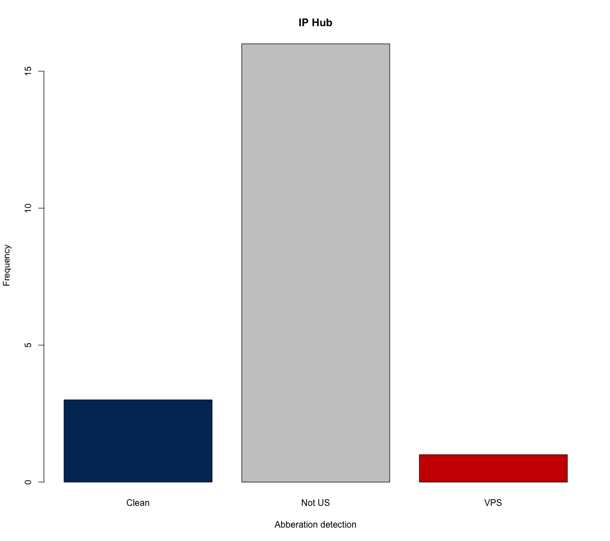

## `rIP` detects Fraud in online surveys by tracing, scoring, and visualizing IP addresses

[](https://CRAN.R-project.org/package=rIP)
[](http://www.r-pkg.org/pkg/rIP)
[](https://doi.org/10.21105/joss.01285)
[](https://github.com/MAHDLab/rIP/pulls)
[](http://cranlogs.r-pkg.org/) -->
<!-- [](https://github.com/MAHDLab/rIP/blob/master/LICENSE) -->

Takes an array of IPs and the keys for the services the user wishes to use (IP Hub, IP Intel, and Proxycheck), and passes these to all respective APIs. Returns a dataframe with the IP addresses (used for merging), country, ISP, labels for non-US IP Addresses, VPS use, and recommendations for blocking. Users also have the option to visualize the distributions.

Especially important in this is the variable "block", which gives a score indicating whether the IP address is likely from a server farm and should be excluded from the data. It is codes 0 if the IP is residential/unclassified (i.e. safe IP), 1 if the IP is non-residential IP (hostping provider, proxy, etc. - should likely be excluded), and 2 for non-residential and residential IPs (more stringent, may flag innocent respondents).

*Note*: `rIP` requires users to have active (free) accounts and/or valid keys at iphub, ipintel, and/or proxycheck. Users may pass any number of IP service keys to the function (e.g., 1, 2, or all 3). The function will work fine with any.

See some related working papers [here](https://papers.ssrn.com/sol3/papers.cfm?abstract_id=3272468) and [here](https://papers.ssrn.com/sol3/papers.cfm?abstract_id=3327274). And the R-Bloggers post is [here](https://www.r-bloggers.com/a-new-release-of-rip-v1-2-0-for-detecting-fraud-in-online-surveys/).

### Installation

Users can install either the stable version released on [CRAN (v1.2.0)](https://CRAN.R-project.org/package=rIP):

```{R}
install.packages("rIP")
library(rIP)
```

Or the dev version directly from our GitHub repo:

```{R}
devtools::install_github("MAHDLab/rIP")
library(rIP)
```

### Usage

```{R}
# Load the library
library(rIP)

# Store personal keys for IP service pings (here we include only "ipHub" as an example)
ip_hub_key <- "MzI2MTpkOVpld3pZTVg1VmdTV3ZPenpzMmhodkJmdEpIMkRMZQ=="

# Generate list of random IP addresses
ipsample <- data.frame(rbind(c(1, "30.139.234.173"), c(2, "105.21.175.134"), c(3, "221.167.14.219"),
                             c(4, "205.218.125.55"), c(5, "191.231.0.156"), c(6, "95.107.54.16"),
                             c(7, "244.206.230.230"), c(8, "210.38.216.32"), c(9, "17.120.223.85"),
                             c(10, "146.153.75.77"), c(11, "246.149.59.225"), c(12, "86.77.82.141"),
                             c(13, "89.151.46.115"), c(14, "229.123.227.10"), c(15, "21.175.8.185"),
                             c(16, "187.193.209.68"), c(17, "74.52.31.169"), c(18, "255.99.244.220"),
                             c(19, "149.106.54.194"), c(20, "244.214.245.239")))

# Store in df
names(ipsample) <- c("number", "IPAddress")

# Call the function (using only `iphub` service)
getIPinfo(ipsample, "IPAddress", iphub_key = ip_hub_key)
```



### Acknowledgements

We thank Tyler Burleigh for his help on this tool.
