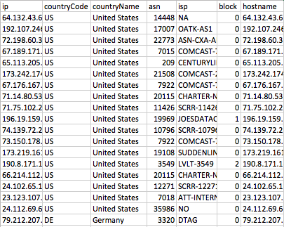

# Summary

The use of survey experiments in political and social research is on the rise. Along with this increase in survey experiments, has come the use of online convenience samples, and, specifically, Amazon's Mechanical Turk (MTurk). Many recent studies have validated the use of MTurk to address substantive questions of interest in the social sciences (e.g., [@clifford:2015] and [@huff:2015]). Yet, recent studies have uncovered that several MTurk surveys have been impacted by "server farms", with IP addresses both disguising respondents' true locations as well as allowing multiple survey responses coming from the same person ([@dreyfuss:2018]). The problem has been traced to the use of Virtual Private Servers (VPS) to answer U.S. surveys from abroad ([@dennis:2018]).

The R package [@team:2000] rIP is dedicated to helping researchers fix this problem, by offering an intuitive, simple-to-use function to check the location and validity of the IP address by pinging an IP verification service (<iphub.info>) that returns the information on the IP, including the internet service provider (ISP) and whether the IP address is likely a server farm being used to disguise the respondent's location. It also detects when responses come from an IP address outside the U.S. These people can then be excluded from analysis, though the decision to include or exclude respondent is left to the researcher. Though the package was designed in response to the scare about MTurk quality regarding IP addresses and server farms, users can use the function to check any vector of IP addresses of interest. Since almost every online survey and app development system allows for the capture of IP addresses, this package can be used on almost any online survey. The implications of this become clearer in the code demonstration below.

For use, users simply need to call the function, `getIPinfo`, and include three pieces of information: the data frame storing the IP addresses to be checked, the name of the column or variable in quotation marks corresponding with the IP addresses within the dataset, and then the user's X-Key in quotation marks to allow users to access iphub's API. Running the `getIPinfo` function returns a dataframe with the IP address, country code, country name, asn, isp, block, and hostname. Especially important in the function is the variable "block", which gives a score indicating whether the IP address is likely from a server farm and should be excluded from the data. It is coded 0 if the IP is residential/unclassified (i.e. safe IP), 1 if the IP is non-residential IP (hostping provider, proxy, etc. - should likely be excluded), and 2 for non-residential and residential IPs (more stringent, may flag innocent respondents). The recommendation from iphub.info is to block or exclude those who score block = 1. Importantly, `rIP` requires an API key from <https://iphub.info/api>. Users can register for a free key that allows for up to 1,000 IP inquiries per day. For examples and more details on syntax, we refer users to the package documentation. Importantly, though, the function was designed with non-programmers in mind to facilitate simple and clear usage to help any researcher diagnose and ameliorate the potential of bots infiltrating online surveys. 

Consider a brief demonstration of the function, using anonymized IP addresses from a recent MTurk survey. For simplicity and safety, we only present the _output_ after running the function, given the need to include a personal X-Key in the function.

```R
library(devtools) # load devtools to use "install_github()"
install_github("MAHDLab/rIP") # load the latest version of the package

data <- read.csv("iphubInfo.csv") # read in data where IP addresses are stored

getIPinfo(data, "ip", "YOUR X-KEY HERE") # run the function
```

The above code will generate the following output (note that a screenshot of the first few observations is included):



The `rIP` package can be installed directly from the source code freely accessible at the corresponding GitHub repository along with all package documentation and an issue tracker.

# Acknowledgements

We thank @tylerburleigh for pointing out the utility of <https://iphub.info>. His method for incorporating this information into Qualtrics surveys can be found [here](https://twitter.com/tylerburleigh/status/1042528912511848448?s=19).

# References
